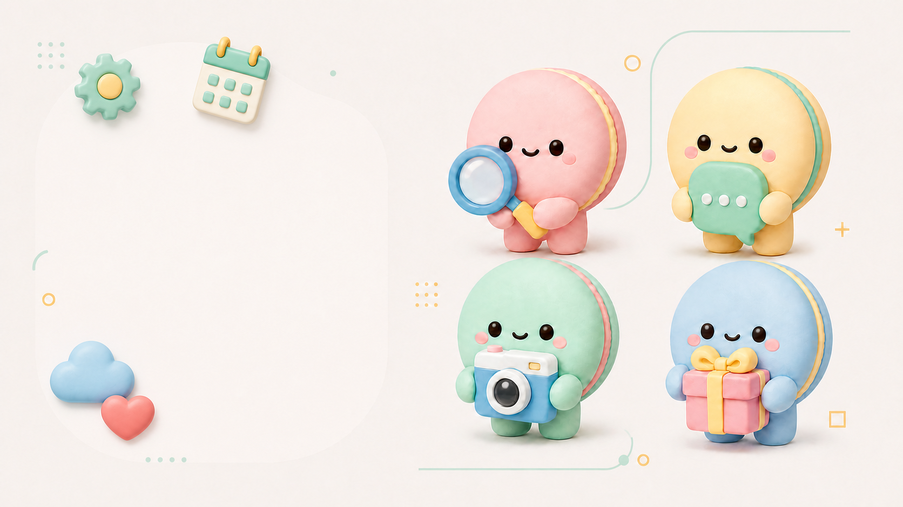

<div align="center">
  
</div>

# HIAPI Icon Skills

让 Codex 生成一套风格统一的产品图标。它会先列出中文风格和色板，再生成整版图标，支持单图返修、独立 PNG、透明背景准备和结果检查。

## 适合做什么

- App、网站和产品功能图标
- 2×2 或多图整版试稿
- 保持同一套材质、视角、光线、比例和留白
- 只修改某一个图标，不影响其他已确认的图标
- 导出独立 1:1 PNG，并准备透明背景版本

## 安装到 Codex

```powershell
npx -y github:HiAPIAI/hiapi-icon-skills -y --codex
```

安装后重启 Codex，在对话里直接说：

```text
请使用 hiapi-icon-skills，先列出可选的中文风格和色板，不要马上生成。
```

## 推荐工作流

先确定方向：

```text
我想给一个 App 做一套功能图标。先帮我从这个 Skill 里选一个圆润、清爽、适合产品界面的中文风格和色板，简单说下理由。
```

再生成一张试稿：

```text
就按刚才这个方向，先做搜索、消息、日历、云端 4 个图标，排成 2×2。统一主体比例、视角、材质、光线和留白，不要文字、Logo 或复杂背景。
```

只返修一个图标：

```text
只改“搜索”这个图标，其他三个不要动。放到 48px 后轮廓不够清楚，请简化轮廓并多留一点空白。颜色、材质、视角和阴影保持上一版。
```

导出项目文件：

```text
把这 4 个图标分别导出成 1:1 独立 PNG，保持刚才的风格和颜色，不要拼成一张图。每张四周留一点空白。
```

## 透明背景

```text
请基于刚才的图标准备透明背景版本。主体、颜色、阴影和尺寸都不要改，边缘要干净，不能留下抠图色边。
```

当前流程使用 Codex 内置 `image_gen` 生成底图，再做背景移除和边缘检查，不宣称是原生透明生成。

## 参考图和安全边界

参考图需要先说明用途，例如 `style`、`composition`、`palette` 或 `subject`。只借鉴高层视觉属性，不复制第三方 Prompt、品牌、角色或素材，也不要把没有授权的参考图当成可直接使用的资产。

当前 Skill 只负责本地任务规划和图像生成流程，不会自动提交付费 HiAPI 任务。需要使用外部付费接口时，请先确认预算和授权。

## 本地 Key

如果本地配置了环境变量，变量名使用 `HIAPI_API_KEY`。可以让 Codex 只检查是否存在，不要输出值：

```text
请检查我本地是否存在 HIAPI_API_KEY，只告诉我存在或不存在，不要打印 Key，也不要创建付费任务。
```

不要把真实 Key 写进仓库、README、截图或公开的 `.env` 文件。

## 开发与测试

```powershell
node --test tests/*.mjs
```

主要入口：`scripts/hiapi-icon-skills.mjs`。

## License

MIT
